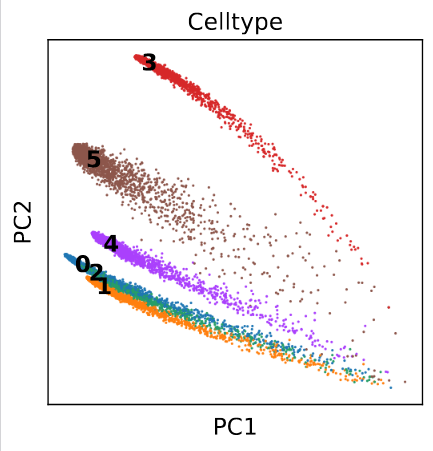
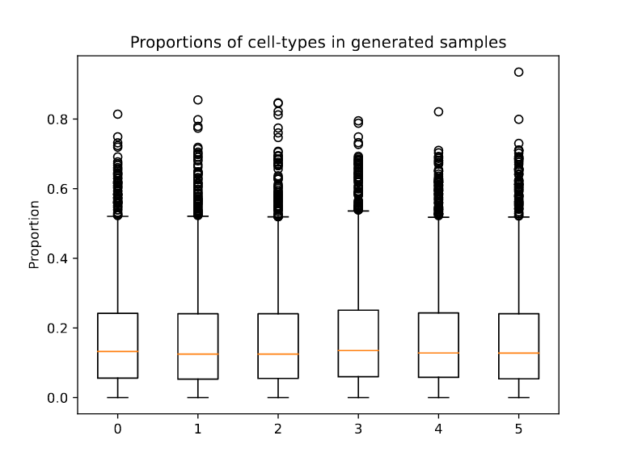

# Simulates bulk and ST transcriptomics datasets from scRNA or snRNA-seq datasets
Input requirement: AnnData compatible h5ad input data object

**Instructions** - 
<ol>
<li>In terminal, Go to the directory where this repository is cloned</li>
<li>Install dependencies with <code>pip install -r requirements.txt</code> </li>
<li>Update <code>main_config.py</code> as per requirements</li>
<li>Make this shell file (<code>.sh</code>) executable with <code>chmod +x run_simulator.sh</code> and then run <code>./run_simulator.sh</code></li>
</ol>

**Time to completion**

It depends on the processor, number of cells, number of genes, number of cell-types and type of simulation (bulk or ST). To simulate 10000 samples from 10x scRNA-seq (n_cells: 8000, n_genes: 17000, n_celltypes: 6), it takes ~1.5 minutes for bulk and ~4 seconds for ST on Mac M1 with 16 gb memory.

**Outputs** - 

After the commands are finished successfully, `experiment_folder` specified in the main_config.py should contain resulting simulated dataset (named - `simulated.h5ad`), and figures in PDF (scatterplots of 2-PCs of simulated dataset and boxplots with sampled proportions). These plots provide a quality control e.g. below is `scatterplot_pca_simulated_celltypes.pdf` which shows the PC embeddings of individual cell type content mixed in each simulated sample. You should note that components are well clustered. If clustering is poor, deconvolution may be unreliable.

Boxplot with sampled proportions indicate the range of proportions. If you have some notion of how much each cell type might be, you can modify `concentration` parameter in `main_config` file. Else, it is mostly uniform like below:

Tested on Ubuntu 20.04 and Mac M1. In case of any problem, please open issue.
